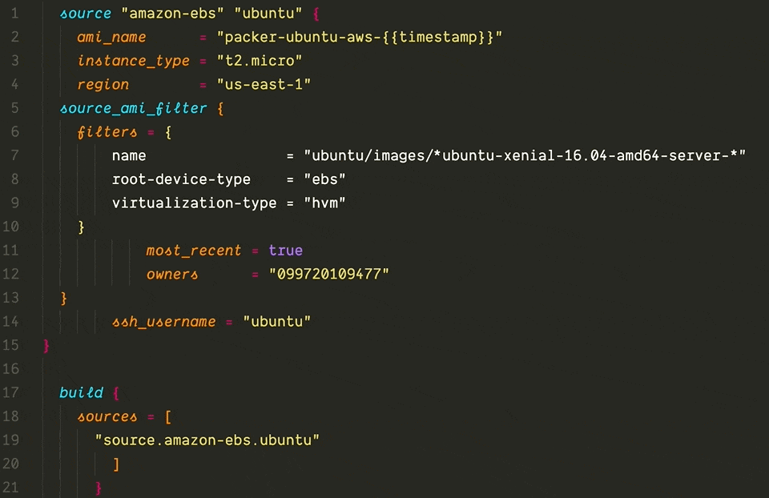
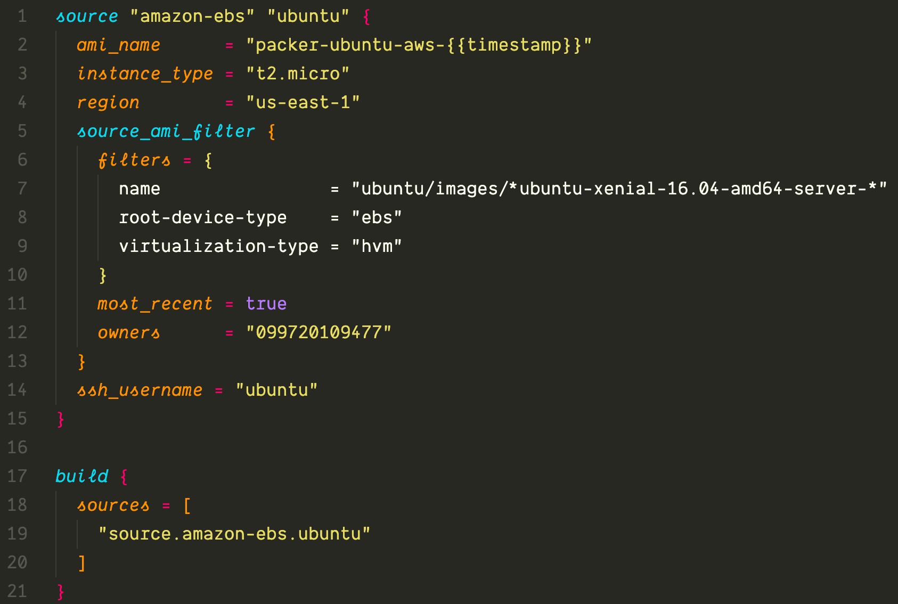
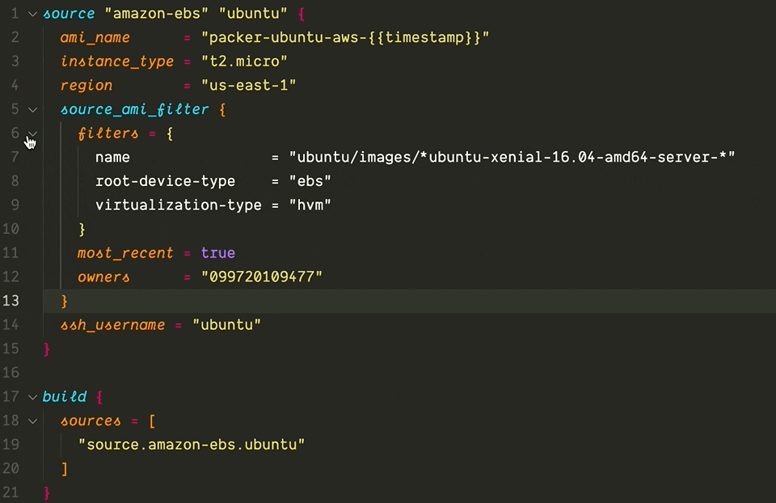
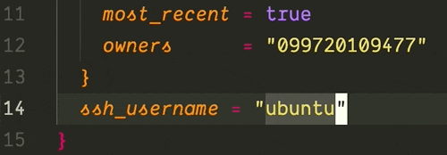
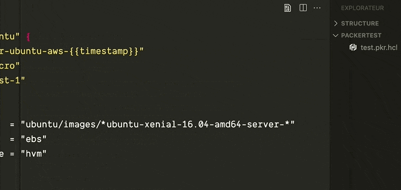

# Packer Powertools

VS Code extension for Packer with code formatting, inline error messages, syntax highlighting, code folding, and command palette integration.

## Features

Code formatting

Validation

Syntax highlighting

Code folding

Toggle comments

Commands

## Requirements

You must have Packer installed and in your system `PATH`.

## Release Notes

### 0.1.0

Initial release
